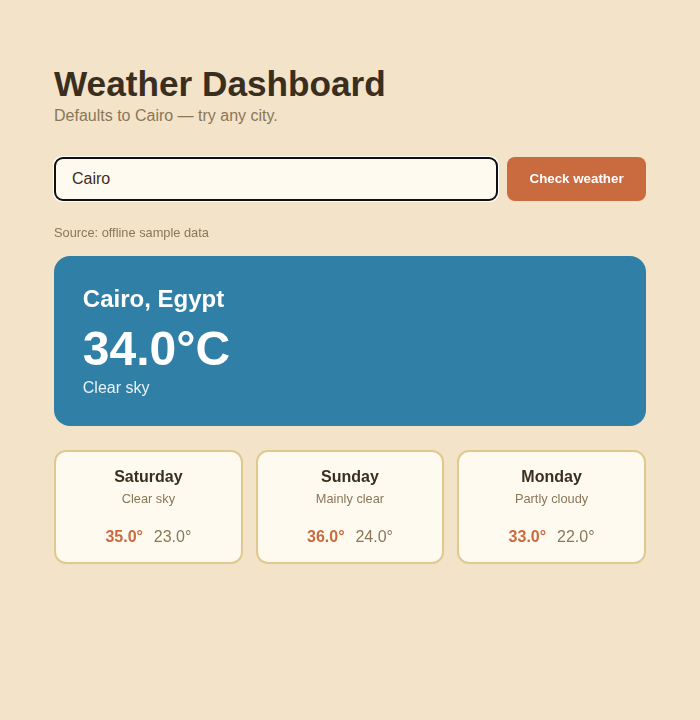

# Cairo-First Weather Dashboard

A "weather dashboard" that defaults to home base — Cairo — but works for
any city: current conditions plus a 3-day forecast, via the free
Open-Meteo API (no API key needed).



This sandbox has no outbound network access, so the screenshot above is
the genuinely-exercised offline fallback path — representative sample
data for Cairo (plus London and Seoul, so it's obviously not hardcoded to
one city), not a live API response.

## Features

- Geocodes any city name via Open-Meteo, then pulls current conditions
  and a 3-day forecast for it — live API with an automatic offline
  fallback on any network/geocoding failure, same pattern as this
  portfolio's other API-integration projects
- A city that genuinely isn't found (live lookup fails *and* it's not in
  the offline sample set) shows a clear "not found" message instead of
  crashing or silently showing stale data
- Forecast logic and Flask routes are tested completely separately: the
  weather-fetching/parsing tests never touch Flask, and the route tests
  mock the weather lookup so they never depend on network state
- A distinct sandy/terracotta/sky-blue visual identity — deliberately its
  own look rather than reusing this portfolio's other Flask apps' themes

## Tech Stack

Python 3 · Flask · `requests` · Open-Meteo API

## Getting Started

```bash
git clone https://github.com/Kazenubis/cairo-weather-dashboard.git
cd cairo-weather-dashboard
pip install -r requirements.txt
python3 app.py
```

Run the tests:

```bash
python3 -m unittest test_weather_service.py test_app.py -v
```

## What I Learned

Open-Meteo's daily forecast array includes *today* at index 0, which
overlaps with the separate `current` conditions data — so a naive "take
the first 3 days" grab would show today's forecast twice, once as
"current" and again mislabeled as tomorrow. The parsing logic explicitly
starts the 3-day forecast at index 1, and
`test_live_path_parses_current_and_three_day_forecast` checks the actual
values line up with the right calendar days, not just that the list
happens to have length 3.
